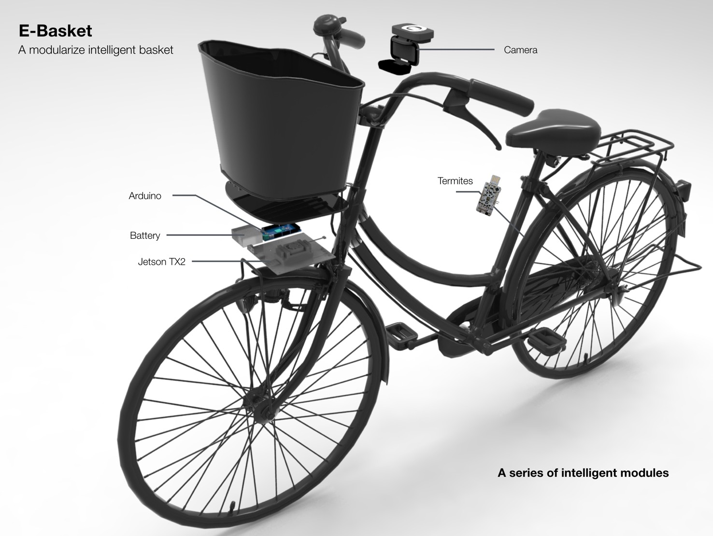

# Panasonic Workshop @ MIT Media Lab

The outcome of this workshop was the **E-Basket**, a basket that can change the assist rate of the panasonic e-assist bike depending on weather, road condition or high density of people.

This is one of the first steps into modularized, autonomous bike components, that can be plugged into any bike and improve its capabilities, while being self-operating outside the bike.



---
---
## Start playing with the code

The code is based on [ROS](http://www.ros.org) (well known open source libraries to develop robotics) running on a Linux based OS. More precisely, the ROS version used was [kinetic](http://wiki.ros.org/kinetic/Installation) and the OS was [Ubuntu 16.04 LTS](http://releases.ubuntu.com/16.04/).

---
### Prerequisites

#### Python and ROS dependencies
Before launching everything, there are some dependencies that need to be installed. So, open up a terminal and run the following commands:
```bash
user@machine:~$ sudo pip install pyserial
user@machine:~$ sudo apt-get install ros-kinetic-serial ros-kinetic-vision-opencv ros-kinetic-usb-cam ros-kinetic-rosserial*
```

#### Tensorflow
If you want to use the tensorflow node, you will need to [download version 1.5](https://www.tensorflow.org/) or higher and the [Object Detection API](https://github.com/tensorflow/models/tree/master/research/object_detection). Make sure you set the `PYTHONPATH` variable properly after installing the object detection API.

---
### Cloning and compiling
To start using the packages, open a terminal and run:
```bash
user@machine:~$ mkdir -p catkin_ws/src && cd catkin_ws/src
user@machine:~/catkin_ws/src$ git clone https://github.com/yagoliz/panasonic_workshop.git
user@machine:~/catkin_ws/src$ cd .. && catkin_make
```

#### Arduino
Code to control a 24-LED Neopixel Ring is also provided in these packages. Flash it to an Arduino board you want and that should be it.

The ring will change its color depending on the assist rate sent to the motor.

---
### Udev rules
In order to make it easier to connect to all the USB devices, there are some scripts that will allow you to give them specific names.

You can read this [document](./terMITe_hardware_rule/termite_rules.md) if you want to set these rules (I highly suggest doing it).

---
### Launching the node

Once everything is set and compiled, you can run the 3 different demos by opening a terminal and typing:

#### Humidity
```bash
user@machine:~$ roslaunch panasonic start_bike.launch mode:=humidity tensorflow:=false
```

#### Acceleration
```bash
user@machine:~$ roslaunch panasonic start_bike.launch mode:=accelerometer tensorflow:=false
```

#### Pedestrian detection
```bash
user@machine:~$ roslaunch panasonic start_bike.launch mode:=pedestrian tensorflow:=true
```